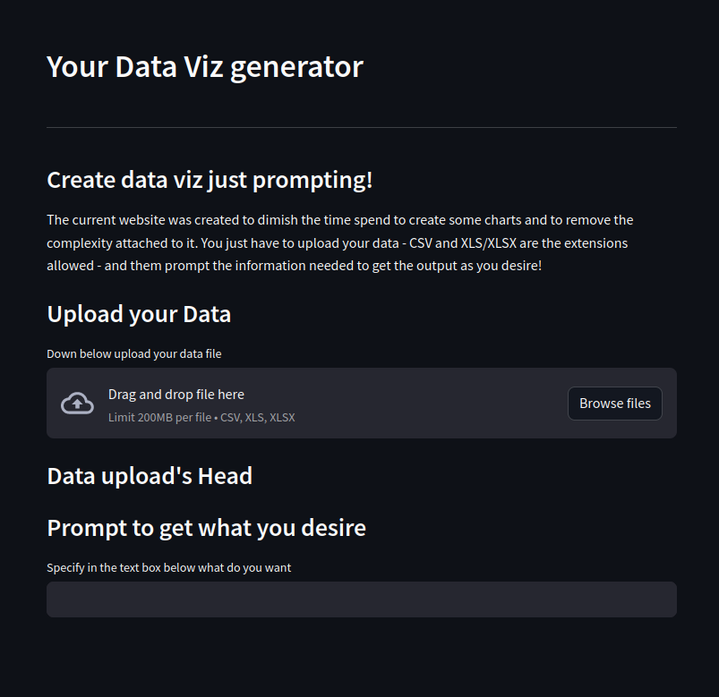
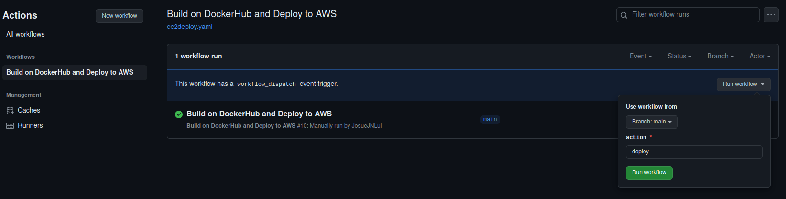
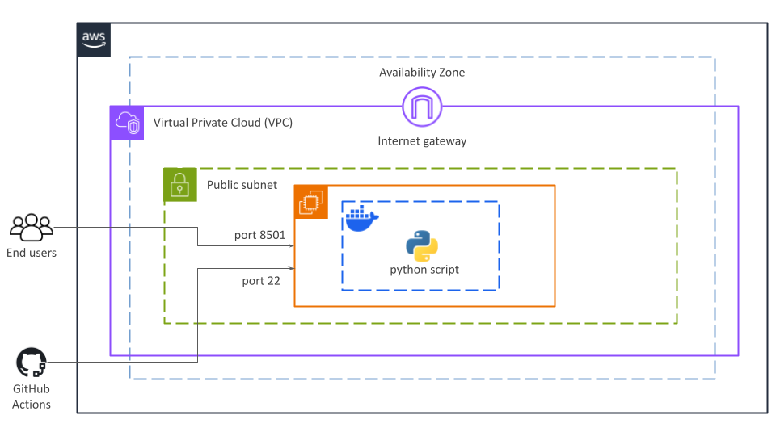

# AI promtp Data Viz

Here's an image of the web interface created from the current project:



## Context
Exploratory data analysis (EDA) is an essential statistical tool for both the academic and professional fields, especially with the constant increase in the volume and complexity of available data. This approach leads to a better initial understanding of the data, identifying trends, patterns, and even insights that may lead to deeper analysis and **making decisions assertively**.

Implementing the exploratory data analysis approach requires technical understanding of statistics and knowledge of helpful software such as Excel, or even proficiency in programming languages such as R and Python. Thus, **it can be a difficult task to achieve if you are not familiar with these tools**. This project is created to **assist non-technical users in conducting their EDA** - users that do not have a deeper knowledge in statistics, statistical software, or programming languages. 

## Solution's Core
The objective is to create a **web interface where the end user can upload their dataset and request information about it**. This information can be displayed as a table, chart, or text. The intention in the near future is to enhance the project so that it can present assumptions and insights regarding the uploaded data without needing a specific prompt from the user.

## Deploy
The deployment of the application can be divided into two phases. The first phase involves creating the cloud infrastructure using Terraform, and the second one involves including and running the container on AWS EC2. Below, I will explain these two phases in more detail.

### Terraform
The cloud infrastructure is built using the Terraform language. Terraform is an infrastructure as code (IaC) tool that allows you to safely and predictably provision and manage infrastructure in any cloud. The source code used in this current project can be found in the following directory: `./terraform`, and the chosen provider was AWS.

### GitHub Actions
After creating the infrastructure on AWS, we have to include and run the Docker container on an EC2 instance. To achieve that, it is necessary to insert the environmental variables as secrets in the GitHub repository. You can find more information about it on the following link: [GitHub Actions](https://docs.github.com/pt/actions/security-guides/using-secrets-in-github-actions)

These are the secrets to be included:
- `AWS_PRIVATE_KEY`: The private key to access the EC2 instance via SSH;
- `AWS_ACCESS_KEY`: A unique identifier associated with an AWS account;
- `AWS_SECRET_KEY`: A secret cryptographic key associated with an AWS Access Key ID;
- `PROJECT_NAME`: The name of the project, which in this context is `ai-prompt-data-viz`.

With that done, the next step is to manually run the workflow on the Actions tab of the GitHub repository:



The workflow can be found in the following directory: `./github/workflows`. It will transfer and synchronize the files into the EC2 instance, and finally, it will run the container. The idea of using GitHub Actions is mainly to attend to continuous development (CD) practices.

## Architecture
Here is the infrastructure of the project as it currently stands. Later in this document, I will highlight some points that I already know can be improved to make this architecture more secure and dynamic.



## Some useful commands

- Initializes Terraform and It forces the reconfiguration of the state:
    ```sh
    terraform init -reconfigure
    ```

- Lists all Terraform workspaces:
    ```sh
    terraform workspace list
    ```

- Shows the currently selected Terraform workspace:
    ```sh
    terraform workspace show
    ```

- Selects the Terraform workspace named "dev":
    ```sh
    terraform workspace select dev
    ```

- Generates an execution plan based on the configuration in "dev.tfvars" and saves it to "plan.tfplan":
    ```sh
    terraform plan -out=plan.tfplan --var-file=dev.tfvars
    ```

- Applies the Terraform execution plan stored in "plan.tfplan":
    ```sh
    terraform apply "plan.tfplan"
    ```

- Generates a plan to destroy existing infrastructure based on the configuration in "dev.tfvars" and saves it to "destroy-plan.tfplan":
    ```sh
    terraform plan -destroy -out=destroy-plan.tfplan --var-file=dev.tfvars
    ```

 - Generates an SSH key pair with a 4096-bit key length, saves the private key to a file specified by the variable "OUTPUT_KEYFILE" and sets an empty passphrase. Then it sets the permissions of the private key file to 600 (read and write by owner only) and the public key file to 644 (read by everyone, write by owner only):
    ```sh
    ssh-keygen -b 4096 -f $OUTPUT_KEYFILE -N "" && \
    chmod 600 kp && \
    chmod 644 kp.pub
    ```

- Establishes an SSH connection to an EC2 instance with the specified public IP address, using the private key located at "/path/to/private-key": 
    ```sh
    ssh -i /path/to/private-key ubuntu@$EC2_PUBLIC_IP
    ```

## Observations

### Nektos Acts
During the development of the project, it was required to test the GitHub Action workflow. To allow for more dynamism, I used Nektos Act extensively, which allows for local testing. The repository for the project can be found here: [Nektos Act](https://github.com/nektos/act). Personally, I highly recommend using

## Next steps
Implementing these changes below will enhance the security and automation of the project.

- Store API keys securely in AWS Systems Manager Parameter Store;
- Modify the Python script to retrieve the API keys from the parameter storage;
- Remove the public IP address from the EC2 instance;
- Configure the application to be accessible only through HTTPS to a specific domain;
- Set up GitHub Actions to trigger the workflow automatically upon a merge into the main branch.

## Technologies

<a href="https://aws.amazon.com/pt/" title="Amazon Web Services">
    
</a>

<a href="https://www.python.org/" title="Python">
    
</a>

<a href="https://git-scm.com/" title="Git">
    
</a>


<a href="https://www.docker.com/" title="Docker">
    
</a>

<a href="https://www.linux.org/" title="Linux">
    
</a>

<a href="https://github.com/" title="GitHub">
    
</a>

<a href="https://docs.github.com/pt/actions" title="GitHub Actions">
    
</a>

<a href="https://streamlit.io/" title="Streamlit">
    
</a>


## Release history

1.0.0 - April 25, 2024
- First Version - josue.lui - April 25, 2024